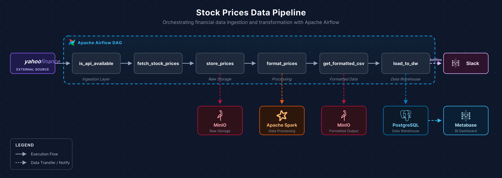

# 📁 Project Documentation

This folder contains the architectural diagrams and design documentation for the **Stock Prices Data Pipeline** built with Apache Airflow.

---

## 📊 Architecture Diagram



| File | Description |
|------|-------------|
| [`pipeline_architecture.png`](./pipeline_architecture.png) | High-quality PNG (4380 × 1560 px, 300 DPI) — best for sharing and embedding |
| [`pipeline_architecture.svg`](./pipeline_architecture.svg) | Scalable vector — renders anywhere without quality loss |
| [`pipeline_architecture.drawio`](./pipeline_architecture.drawio) | Editable source — open with [draw.io](https://app.diagrams.net/) or the VS Code Draw.io extension |

---

## 🏗️ Pipeline Architecture Overview

```
Yahoo Finance API
      │
      ▼
is_api_available ──► fetch_stock_prices ──► store_prices ──► format_prices ──► get_formatted_csv ──► load_to_dw ──► Slack
                                                 │                  │                   │                   │
                                              MinIO              Spark               MinIO            PostgreSQL
                                           (Raw Data)         (Transform)         (Formatted)        (DW / BI)
                                                                                                          │
                                                                                                       Metabase
```

### Layer Breakdown

| Layer | Tasks / Services | Description |
|-------|-----------------|-------------|
| **Ingestion** | `is_api_available`, `fetch_stock_prices` | HTTP sensor + Yahoo Finance API fetch |
| **Raw Storage** | `store_prices` → MinIO | Upload raw stock prices to object storage |
| **Processing** | `format_prices` → Apache Spark | Distributed transformation and cleaning |
| **Formatted Storage** | `get_formatted_csv` → MinIO | Store cleaned CSV for downstream use |
| **Data Warehouse** | `load_to_dw` → PostgreSQL | Bulk load formatted data |
| **Visualization** | Metabase ← PostgreSQL | BI dashboards and analytics |
| **Notification** | `load_to_dw` → Slack | Alert on pipeline success or failure |

---

## 🛠️ How to Open the Diagram

### Option A — draw.io Web App

1. Go to [https://app.diagrams.net/](https://app.diagrams.net/)
2. Click **File → Open from → Device**
3. Select `pipeline_architecture.drawio`

### Option B — VS Code Extension

1. Install the [Draw.io Integration](https://marketplace.visualstudio.com/items?itemName=hediet.vscode-drawio) extension
2. Open `pipeline_architecture.drawio` directly in VS Code — it renders inline

### Option C — SVG Preview

The `pipeline_architecture.svg` renders natively in:
- VS Code Markdown Preview (open `README.md` → `Ctrl+Shift+V`)
- GitHub repository view (just navigate to this folder)
- Any modern web browser

---

## 📌 Technologies Referenced

| Technology | Role | Docs |
|------------|------|------|
| Apache Airflow | Pipeline orchestration | [airflow.apache.org](https://airflow.apache.org/) |
| Yahoo Finance API | Market data source | [finance.yahoo.com](https://finance.yahoo.com/) |
| MinIO | Object storage | [min.io](https://min.io/) |
| Apache Spark | Distributed processing | [spark.apache.org](https://spark.apache.org/) |
| PostgreSQL | Data warehouse | [postgresql.org](https://www.postgresql.org/) |
| Metabase | BI / visualization | [metabase.com](https://www.metabase.com/) |
| Slack | Notifications | [slack.com](https://slack.com/) |

---

> Back to [project root README](../README.md)
