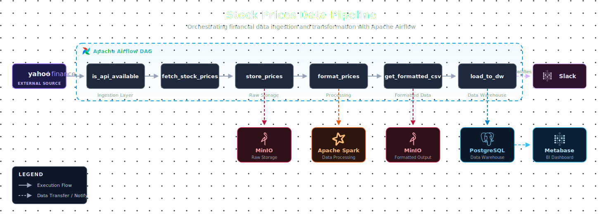

# 📁 Project Documentation

This folder contains architectural and design documentation for the **Stock Prices Data Pipeline** built with Apache Airflow.

---

## 📊 Diagrams



| File | Description |
|------|-------------|
| [`pipeline_architecture.svg`](./pipeline_architecture.svg) | Modernized high-resolution vector architecture |
| [`pipeline_architecture.drawio`](./pipeline_architecture.drawio) | Editable source — open with [draw.io](https://app.diagrams.net/) or VS Code draw.io extension |

---

## 🏗️ Pipeline Architecture Overview

```
Yahoo Finance API ──► is_api_available ──► fetch_stock_prices ──► store_prices ──► format_prices ──► get_formatted_csv ──► load_to_dw ──► Slack
                                                                        │                  │                   │                   │
                                                                      Minio             Spark               Minio            Postgres
                                                                   (Raw Data)       (Transform)          (Formatted)       (DW / BI)
                                                                                                                               │
                                                                                                                           Metabase
```

### Layers

| Layer | Tasks / Services | Description |
|-------|-----------------|-------------|
| **Ingestion** | `is_api_available`, `fetch_stock_prices` | Sensor + fetch from Yahoo Finance API |
| **Storage (Raw)** | `store_prices` → Minio | Store raw stock prices in object storage |
| **Processing** | `format_prices` → Apache Spark | Transform and format raw data |
| **Storage (Formatted)** | `get_formatted_csv` → Minio | Store cleaned CSV for downstream use |
| **Data Warehouse** | `load_to_dw` → PostgreSQL | Load formatted data into the data warehouse |
| **Visualization** | Metabase ← PostgreSQL | Business intelligence dashboards |
| **Notification** | `load_to_dw` → Slack | Alert on pipeline completion or failure |

---

## 🛠️ How to Open the Diagram

### Option 1 – draw.io Web App
1. Go to [https://app.diagrams.net/](https://app.diagrams.net/)
2. Click **File → Open from → Device**
3. Select `pipeline_architecture.drawio`

### Option 2 – VS Code Extension
1. Install the [Draw.io Integration](https://marketplace.visualstudio.com/items?itemName=hediet.vscode-drawio) extension
2. Open `pipeline_architecture.drawio` directly in VS Code

---

## 📌 Technologies Used

| Technology | Role |
|------------|------|
| Apache Airflow | Pipeline orchestration |
| Yahoo Finance API | Data source |
| Minio | Object storage (raw + formatted) |
| Apache Spark | Distributed data processing |
| PostgreSQL | Data warehouse |
| Metabase | Business intelligence / visualization |
| Slack | Pipeline notifications |
